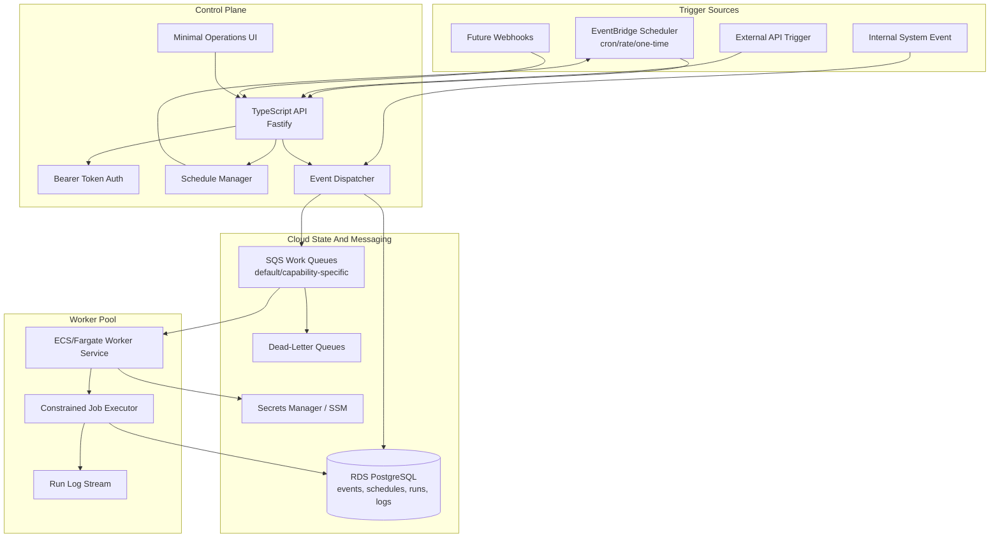
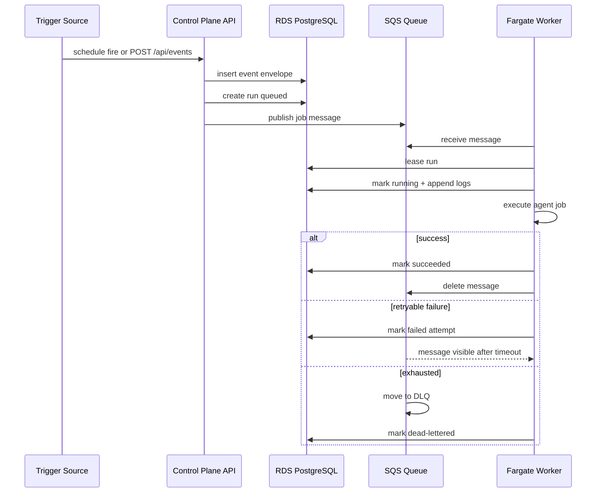

# Project Design: Event Agent

Event Agent is a cloud-hosted event and worker system for agent jobs. It is designed around explicit triggers and durable runs instead of a continuously running autonomous loop.

## 1. System Design Diagram



## 2. High-Level Design

The system has four main subsystems:

- **Control plane:** authenticated API, schedule CRUD, manual triggers, run inspection, retry/cancel actions, and UI assets.
- **Trigger adapters:** EventBridge Scheduler for cron/rate events, API events for external triggers, internal events from workers/control-plane logic, and future webhook adapters.
- **Persistence and messaging:** RDS PostgreSQL for queryable state and SQS for durable executable work.
- **Workers:** stateless ECS/Fargate services that consume queues, lease runs, execute jobs, emit logs, and update status.

The first implementation keeps the adapter interfaces small so local smoke tests can run with in-memory adapters while hosted runtime uses AWS-backed adapters.

## 3. Job Data Flow



## 4. Hosting Decisions

Default AWS stack:

- **API/UI:** ECS/Fargate service, likely behind an Application Load Balancer initially.
- **Workers:** ECS/Fargate services per queue/capability group.
- **Database:** Amazon RDS PostgreSQL.
- **Schedules:** EventBridge Scheduler.
- **Queues:** SQS standard queues with DLQs.
- **Secrets:** AWS Secrets Manager or SSM Parameter Store.
- **Logs/metrics:** CloudWatch Logs and CloudWatch metrics.

Aurora Serverless v2 remains a later option for spiky or multi-tenant workloads. EKS remains a later worker-pool backend after the queue/run contract proves stable.

## 5. Worker Contract

Workers consume messages with this conceptual shape:

```json
{
  "runId": "run_...",
  "eventId": "evt_...",
  "queue": "default",
  "attempt": 1
}
```

Workers must:

- Validate the run exists before execution.
- Acquire or renew a run lease.
- Handle duplicate delivery safely.
- Append structured logs.
- Mark terminal status exactly once when possible.
- Keep side effects idempotent via event/run dedupe keys.
- Respect timeout and cancellation signals.

## 6. Safety Model

V1 safety priorities:

- Single bearer token for all non-health API routes.
- No secrets in repo-tracked config.
- Scoped environment variables per worker.
- Containerized worker process isolation.
- Explicit queue/capability routing so high-risk jobs can use separate workers.
- Audit logs for every event, run, retry, cancellation, and worker execution.

Future safety additions:

- Approval gates for high-risk tools.
- Per-run ECS tasks for stronger isolation.
- Tenant/project auth and scoped tokens.
- Webhook signature verification.
- Policy engine for tools, networks, and filesystem access.

## 7. Implementation Shape

Initial repo layout:

- `src/shared`: types, config, small utility contracts.
- `src/server`: API/control-plane app.
- `src/worker`: queue worker entrypoint and execution loop.
- `src/ui`: minimal browser UI shell.
- `src/infra`: cloud architecture notes.
- `infra`: AWS CDK app that synthesizes CloudFormation for the initial cloud runtime.
- `scripts`: smoke and helper scripts.

The first code checkpoint intentionally uses in-memory adapters for verification. The CDK checkpoint provisions the intended AWS shape, but the next implementation milestone should replace the persistence and queue interfaces with RDS/SQS adapters while keeping the API and worker contracts stable.
