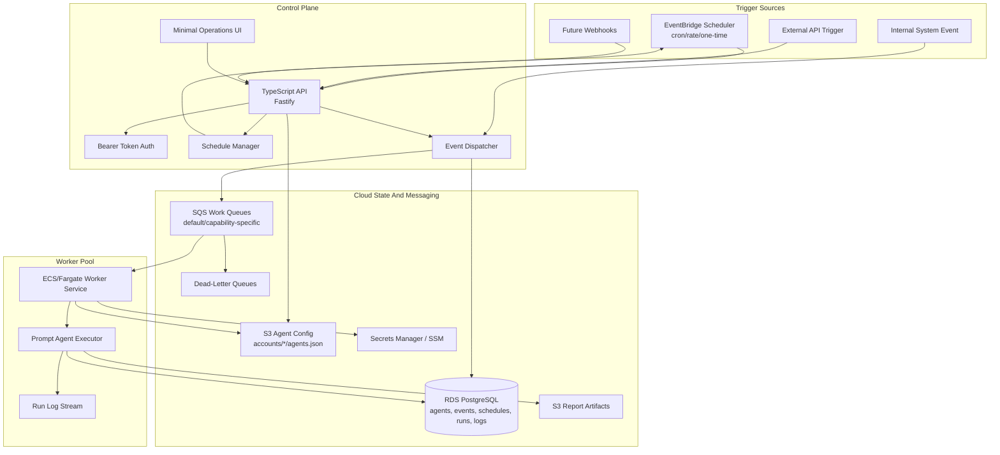
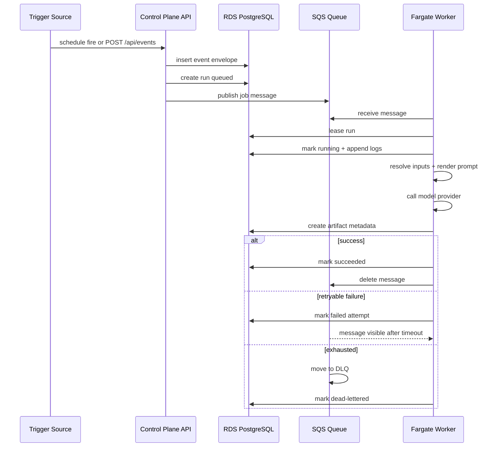

# Project Design: Event Agent

Event Agent is a cloud-hosted event and worker system for agent jobs. It is designed around explicit triggers and durable runs instead of a continuously running autonomous loop.

## 1. System Design Diagram



## 2. High-Level Design

The system has four main subsystems:

- **Control plane:** authenticated API, data-driven agent creation, schedule creation, EventBridge Scheduler reconciliation for created agent schedules, manual triggers, run inspection, retry/cancel actions, and UI assets.
- **Trigger adapters:** EventBridge Scheduler for cron/rate events, API events for external triggers, internal events from workers/control-plane logic, and future webhook adapters.
- **Persistence and messaging:** RDS PostgreSQL for queryable state and SQS for durable executable work.
- **Workers:** stateless ECS/Fargate services that consume queues, lease runs, execute jobs, emit logs, and update status.
- **Agents:** data-driven prompt definitions loaded from account-scoped S3 JSON config and upserted into Postgres for query/runtime state. A prompt agent contains prompt text, input resolver config, model provider/model, and output settings. Adding an agent should not require adding an agent-specific TypeScript file.

The first implementation keeps the adapter interfaces small so local smoke tests can run with in-memory adapters while hosted runtime uses AWS-backed adapters.

## 3. Job Data Flow



## 4. Hosting Decisions

Default AWS stack:

- **API/UI:** ECS/Fargate service, likely behind an Application Load Balancer initially.
- **Workers:** ECS/Fargate services per queue/capability group.
- **Database:** Amazon RDS PostgreSQL.
- **Schedules:** EventBridge Scheduler.
- **Queues:** SQS standard queues with DLQs.
- **Secrets:** AWS Secrets Manager or SSM Parameter Store.
- **Agent config:** private S3 bucket containing `accounts/<account-id>/agents.json`; the dev stack deploys a seed default under `seed/accounts/default/agents.json`.
- **Logs/metrics:** CloudWatch Logs and CloudWatch metrics.

Aurora Serverless v2 remains a later option for spiky or multi-tenant workloads. EKS remains a later worker-pool backend after the queue/run contract proves stable.

## 5. Worker Contract

Workers consume messages with this conceptual shape:

```json
{
  "kind": "run",
  "runId": "run_...",
  "eventId": "evt_...",
  "queue": "default",
  "attempt": 1
}
```

Scheduled prompt agents may also arrive as:

```json
{
  "kind": "agent.trigger",
  "scheduleId": "sch_stock_report_daily",
  "agentId": "agent_stock_report_daily",
  "firedAt": "2026-06-23T16:00:00.000Z",
  "dedupeKey": "sch_stock_report_daily:2026-06-23:agent_stock_report_daily"
}
```

Workers must:

- Validate the run exists before execution.
- Load prompt-agent definitions from the store instead of importing agent-specific code.
- Acquire or renew a run lease.
- Handle duplicate delivery safely.
- Append structured logs.
- Mark terminal status exactly once when possible.
- Keep side effects idempotent via event/run dedupe keys.
- Respect timeout and cancellation signals.

## 6. Safety Model

V1 safety priorities:

- Single bearer token for all non-health API routes.
- No secrets in repo-tracked config.
- Scoped environment variables per worker.
- Containerized worker process isolation.
- Explicit queue/capability routing so high-risk jobs can use separate workers.
- Audit logs for every event, run, retry, cancellation, and worker execution.

Future safety additions:

- Approval gates for high-risk tools.
- Per-run ECS tasks for stronger isolation.
- Tenant/project auth and scoped tokens.
- Webhook signature verification.
- Policy engine for tools, networks, and filesystem access.

## 7. Implementation Shape

Initial repo layout:

- `src/shared`: types, config, small utility contracts.
- `src/server`: API/control-plane app.
- `src/worker`: queue worker entrypoint and execution loop.
- `src/agents`: reusable prompt execution primitives, provider adapters, artifact writers, and shared input resolvers.
- `config`: versioned account-scoped agent/schedule config documents deployed to S3.
- `src/ui`: minimal browser UI shell.
- `src/infra`: cloud architecture notes.
- `infra`: AWS CDK app that synthesizes CloudFormation for the initial cloud runtime.
- `scripts`: smoke and helper scripts.

The first hosted prompt-agent checkpoint uses Postgres for state, SQS for work, S3 for markdown report artifacts, S3 for account-scoped agent config, and a direct model-provider adapter. The daily stock agent, its prompt, model settings, output settings, schedule definition, and static stock input list live in `config/accounts/default/agents.json`; TypeScript remains generic platform code.

## 8. Agent Config Source

Runtime startup calls `seedDefaultAgents`, which loads the agent config document from:

1. `s3://<EVENT_AGENT_CONFIG_BUCKET>/<EVENT_AGENT_CONFIG_PREFIX>/<token-derived-account-id>/agents.json`
2. `s3://<EVENT_AGENT_CONFIG_BUCKET>/<EVENT_AGENT_CONFIG_PREFIX>/default/agents.json`
3. `s3://<EVENT_AGENT_CONFIG_BUCKET>/seed/<EVENT_AGENT_CONFIG_PREFIX>/default/agents.json`
4. `EVENT_AGENT_LOCAL_CONFIG_PATH` when no config bucket is configured

The dev stack pins `EVENT_AGENT_CONFIG_ACCOUNT_ID=default` for now. The API writes created agents back to `accounts/default/agents.json`, preserving the starter seed as fallback-only config. A later scoped-token or OIDC model can map each caller/account to its own config object without changing the worker execution contract.

Current limitation: the API creates EventBridge Scheduler resources for newly created agent schedules, but there is not yet a full reconciliation loop that continuously diffs S3/database schedule definitions against EventBridge Scheduler. The daily stock example still has a CDK-managed scheduler resource for bootstrapping.
